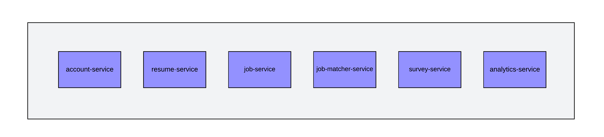

# Ctrl+Alt+Elite - O'Reilly Architectural Katas: Fall 2024

Hello! We are the Ctrl+Alt+Elite team hailing from Bangalore, India, and we are here to present our solution for the O'Reilly Architectural Katas: Fall 2024.

## Team Members 
[Krishnaraj Ramakrishna](https://www.linkedin.com/in/krishnaraj-vr-8869b45/)  
[Raghu A M](https://www.linkedin.com/in/raghu-a-m-6381b614/)  
[Santosh Kumar](https://www.linkedin.com/in/santoshk31/)

## Contents
- [Introduction](#introduction)  
- [Requirements](#requirements)
    - [Business Requirments](#business-requirments)  
    - [Technical Requirements](#technical-requirements)
    - [Other Considerations](#other-considerations)
- [Architecture Characteristics](#architecture-characteristics) 
    - [Top 3 Characteristics](#top-3-characteristics)
    - [Implicit Characteristics](#implicit-characteristics)
- [Architecture Approach](#architecture-approach)
- [Use Journey](#use-journey)
    - [User experience (UX) design](#user-experience-ux-design)
- [Event Storming](#event-storming)
- [Context](#context)
    - [Complete Overview](#complete-overview)
    - [Context Diagram](#context-diagram)
- [Containers](#containers)
    - [Road Warrior System](#road-warrior-system)
- [Components](#components)
    - [API Application](#api-application)
    - [Batch Process](#batch-process)
    - [AI Engine](#batch-process)
- [Deployment](#deployment)
- [ADRs](#adrs)

## Introduction

## Requirements

### Business Requirments
#### Epic-01 :: **Core System Module:**
- **US-01:** As the ClearView system, I want to **generate AI-based resume tips,** so that job seekers can imprtes.
- **US-02:** As the ClearView system, I want to **manage invoicing for resume unlocks,** so that recruiters are charged for unlocking candidate information.
- **US-03:**  As the ClearView system, I want to **gather metrics and analytics,** so that system performance and user behavior can be monitored and improved.ove their resumes.
- **US-04:** As the ClearView system, I want to **anonymize resumes using AI,** so that candidate privacy is maintained until employers unlock the resumes.
- **US-05:** As the ClearView system, I want to **perform candidate-job matching,** so that job seekers can find relevant opportunities and recruiters can find suitable candida

#### Epic-02 :: **User (Candidate) Module:**
- **US-06:** As a job seeker, I want to **register**, upload, and update my resume, so that I can submit it for job opportunities.
- **US-07:** As a job seeker, I want to **view matched jobs** and manage the unlocking of my resume by employers, so that I can track my job applications.
- **US-08:** As a job seeker, I want to **anonymize my resume using AI,** so that I can maintain privacy before employers unlock my full information.
- **US-09:** As a job seeker, I want to **receive AI-generated resume tips,** so that I can improve my resume to increase my chances of getting hired.

#### Epic-03 :: **HR/Recruiter Module:**
- **US-10:** As a recruiter, I want to **register and enter company information using AI,** so that I can manage job postings and candidates.
- **US-11:** As a recruiter, I want to **post and update job descriptions,** so that I can attract relevant candidates to my job listings.
- **US-12:** As a recruiter, I want to **view candidate matches,** unlock resumes, and track their hiring status, so that I can streamline the hiring process.
- **US-13:** As a recruiter, I want to **mark candidates as hired or passed,** so that I can keep track of recruitment outcomes.

#### Epic-04 :: **Admin Module:**
- **US-14:** As an admin, I want to **manage user information and internal data,** so that I can ensure system operations run smoothly.
- **US-15:** As an admin, I want to **generate analytics and reports,** so that I can provide insights on system usage and candidate-employer interactions.

#### Epic-05 :: **Technical Requirements:**
- **US-16:** Richest user interface possible across all deployment platforms.
- **US-17:** Users must be able to access the system at all times (max 5 minutes per month of unplanned downtime).
- **US-18:** Response time from web (800ms) and mobile (First-contentful paint of under 1.4 sec)

## Assumptions
- Assume a trained LLM for purposes of the solution

## Quality Attribute Requirements
This section outlines the Quality Attribute Requirements that exert a critical influence on the overarching architecture of the software solution.
| Id | Quality Attribute | Description |
| --------- | --------- | --------- |
| QA1 | Scalability | US-16: Supports 2 million active users/week |
| QA2 | Scalability | US-17: Supports total users: 15 million (user accounts) |
| QA3 | Performance | US-03: Updates must be in the app within 5 minutes of an update (better than the competition) |
| QA4 | Performance | US-14: Travel updates must be presented in the app within 5 minutes of generation by the source.|
| QA5 | Availability | US-13: Users must be able to access the system at all times (max 5 minutes per month of unplanned downtime). |
| QA6 | Responsiveness | US-15: Response time from web (800ms) and mobile (First-contentful paint of under 1.4 sec) |
| QA7 | Interoperability | US-03: The system must interface with the agency’s existing airline, hotel, and car rental interface system |
| QA8 | Usability | US-12: Richest user interface possible across all deployment platforms. |
| QA9 | Usability | US-11: Must work internationally. |
| QA10 | Security | US-01: Poll E-Mail looking for travel-related E-Mail.  |

## Architecture Characteristics
To ensure a successful system implementation, it's vital to prioritize key architecture characteristics. These elements guarantee reliability, availability, and responsiveness, delivering a seamless user experience.

*Figure: Architecture Characteristics*

## Top 3 Characteristics
The key architectural characteristics of the recruitment system that leverages AI LLM for resume recommendations, candidate scoring, and job matching, while integrating with multiple HRMS systems, focus on **Scalability**, **Performance**, and **Interoperability**. Here's how these characteristics shape the system:

### 1. **Scalability**
- **Handling Growth**: The system must efficiently scale to accommodate an increasing number of candidates, resumes, and job postings as businesses expand. Scalability ensures smooth operation under fluctuating workloads, including more AI-driven analysis and HRMS integrations.
- **AI Resource Optimization**: As the system processes more resumes and handles higher candidate scoring and job matching volumes, resources need to be dynamically managed to support seamless AI model execution, especially during peak loads.

### 2. **Performance**
- **Fast AI-Driven Results**: High computational performance is essential for AI LLM models to provide real-time resume recommendations and candidate scoring, delivering immediate feedback to users on job matches and recommendations.
- **Efficient HRMS Data Retrieval**: The system must rapidly fetch job details and other data from multiple HRMS systems without introducing latency, ensuring job matching is prompt and system responsiveness is maintained.
- **Enhanced User Experience**: Fast, reliable responses to user actions—such as uploading resumes or generating job matches—are crucial for delivering a smooth and efficient experience for both candidates and recruiters.

### 3. **Interoperability**
- **Seamless HRMS Integration**: The system needs to integrate effortlessly with various external HRMS platforms, regardless of their underlying technology or data formats, ensuring smooth communication and data exchange.
- **Consistent Data Formatting**: With different HRMS systems potentially using varied data structures, interoperability ensures standardized data handling, enabling the AI models to process information accurately across platforms.
- **Future-Proofing**: Interoperability allows the recruitment system to integrate with new HRMS platforms or technologies over time, adapting to evolving business requirements without major re-engineering efforts.

## Implicit Characteristics
### Feasibility (Cost/Time)
Achieving rapid time-to-market while managing development costs is a feasible goal with the selected "mini-services" architecture.
### Maintainability
Ensuring clean code, documentation, and knowledge sharing within the development team are essential for long-term system maintainability.
### Observability
Implementing comprehensive monitoring and observability solutions enables efficient tracking of system performance and early issue detection for proactive problem-solving.

## Architecture Approach
### Architecture Style

*Figure: Architecture Style*

### Performance

  
## Use Journey 

### User experience (UX) design
#### Candidate 
##### Register
 
 
 ##### Dashboard
 

 ##### [Figma Walkthroug](https://www.figma.com/proto/VS5JPjs071q8xRwnhh2VGi/Architectural-Katas?page-id=0%3A1&node-id=2-2&node-type=canvas&viewport=538%2C192%2C0.13&t=8IGLuCUeOYYQIMy2-1&scaling=contain&content-scaling=fixed&starting-point-node-id=2%3A2)

  
#### Employer  
##### Register
 
 
 ##### Dashboard
 

 ##### [Figma Walkthroug](https://www.figma.com/proto/VS5JPjs071q8xRwnhh2VGi/Architectural-Katas?page-id=104%3A8588&node-id=239-5113&node-type=frame&viewport=2015%2C545%2C0.5&t=AQYBmgaBM6dlXAo0-1&scaling=min-zoom&content-scaling=fixed&starting-point-node-id=239%3A5113)

#### Admin 
##### Register
 
 
 ##### Dashboard
 

 ##### [Figma Walkthroug](https://www.figma.com/proto/VS5JPjs071q8xRwnhh2VGi/Architectural-Katas?page-id=104%3A8587&node-id=239-4832&node-type=canvas&viewport=1322%2C534%2C0.5&t=Fyp3n978SR87r8wR-1&scaling=min-zoom&content-scaling=fixed&starting-point-node-id=239%3A4832)

## Exploring components

We conducted an Event Storming technique to identify the main components of the Clearview system. This collaborative workshop helped us visualize system workflows, identify domain events, and determine the interactions between components. Through this process, we [identified the necessary components and their relationships](EventStorming/EventStorming.md), informing the design and implementation of the system. Here are the results:

---

## 1. Account-Service

**Bounded Context:** User & Role

### **Description**
The **Account-Service** is the cornerstone for managing user identities and roles within the system. It oversees the creation, authentication, authorization, and maintenance of user profiles for different user types, including candidates, employers, and administrators.

### **Key Features**
- **User Management**
  - **Registration & Onboarding:** Facilitates user sign-up processes for candidates, employers, and admins.
  - **Profile Management:** Allows users to create, update, and delete their profiles with relevant information.
  - **Password Management:** Handles password creation, resets, and recovery mechanisms securely.

- **Role Management**
  - **Role Assignment:** Assigns specific roles (e.g., candidate, employer, admin) to users based on their type and permissions.
  - **Permission Control:** Defines and manages access levels for different roles to ensure appropriate access to system functionalities.

- **Authentication & Authorization**
  - **Secure Login:** Implements secure authentication protocols (e.g., OAuth, JWT) for user login.
  - **Session Management:** Manages user sessions to maintain security and user experience.
  - **Access Control:** Enforces authorization rules to restrict access to sensitive operations and data.

- **Security**
  - **Data Encryption:** Ensures that sensitive user data is encrypted both at rest and in transit.
  - **Compliance:** Adheres to data protection regulations such as GDPR and CCPA to protect user privacy.

- **Audit & Logging**
  - **Activity Logs:** Maintains logs of user activities for auditing and monitoring purposes.
  - **Security Audits:** Regularly audits security measures to identify and mitigate potential vulnerabilities.

---

## 2. Resume-Service

**Bounded Context:** Resume Processing

### **Description**
The **Resume-Service** is dedicated to handling all aspects of resume management. It processes resumes submitted by candidates, ensuring that data is parsed accurately, anonymized for privacy, and securely stored.

### **Key Features**
- **Resume Parsing**
  - **Format Support:** Parses resumes in various formats such as PDF, DOCX, and plain text.
  - **Data Extraction:** Extracts structured data like personal information, education, work experience, and skills.

- **Data Anonymization**
  - **Privacy Protection:** Removes or masks personally identifiable information (PII) to maintain candidate confidentiality.
  - **Customizable Anonymization Rules:** Allows configuration of which data fields to anonymize based on compliance requirements.

- **Secure Storage**
  - **Encrypted Storage:** Stores resumes in encrypted databases to prevent unauthorized access.
  - **Backup & Recovery:** Implements robust backup strategies to ensure data integrity and availability.

- **Resume Validation**
  - **Format Verification:** Ensures that resumes adhere to the required formats and standards.
  - **Content Validation:** Checks for completeness and relevance of the information provided.

- **Integration APIs**
  - **Data Accessibility:** Provides APIs for other services (e.g., Job-Matcher-Service) to access and utilize resume data securely.
  - **Real-time Updates:** Ensures that any changes in resume data are propagated in real-time to dependent services.

- **Version Control**
  - **Resume History:** Maintains versions of resumes to track changes over time.
  - **Rollback Mechanism:** Allows reverting to previous versions if necessary.

---

## 3. Job-Service

**Bounded Context:** Job Scheduler

### **Description**
The **Job-Service** manages the scheduling and fetching of job-related tasks within the system. It ensures that job postings are created, updated, deleted, and retrieved efficiently to facilitate seamless interactions between employers and candidates.

### **Key Features**
- **Job Scheduling**
  - **Automated Posting:** Schedules job postings based on predefined criteria and timelines.
  - **Recurring Jobs:** Supports recurring job postings for positions that require ongoing recruitment.

- **Job Management**
  - **Create & Edit Jobs:** Allows employers to create new job postings and edit existing ones with detailed descriptions, requirements, and benefits.
  - **Delete Jobs:** Enables employers to remove job postings that are no longer relevant or have been filled.

- **Job Retrieval**
  - **Search & Filter:** Provides robust search and filtering capabilities to help users find relevant job postings.
  - **Pagination & Sorting:** Supports efficient data retrieval with pagination and sorting options for large datasets.

- **Integration with Other Services**
  - **Job-Matcher Integration:** Interfaces with the Job-Matcher-Service to provide up-to-date job postings for matching candidates.
  - **Notification Triggers:** Works with the Survey-Service to notify users about job-related updates and surveys.

- **Job Analytics**
  - **Performance Metrics:** Tracks metrics such as the number of views, applications, and engagement rates for each job posting.
  - **Reporting Tools:** Provides data for generating reports on job posting effectiveness and trends.

- **Compliance & Standards**
  - **Regulatory Compliance:** Ensures that job postings comply with labor laws and industry standards.
  - **Content Moderation:** Implements checks to prevent inappropriate or non-compliant job descriptions.

---

## 4. Job-Matcher-Service

**Bounded Context:** Job Matching

### **Description**
The **Job-Matcher-Service** is the core component responsible for pairing candidates with suitable job opportunities. It utilizes advanced algorithms and data analytics to ensure optimal matches based on various criteria and preferences.

### **Key Features**
- **Matching Algorithms**
  - **Skill-Based Matching:** Aligns candidate skills with job requirements to find the best fits.
  - **Preference Matching:** Considers candidate and employer preferences, such as location, salary, and job type.

- **Real-Time Matching**
  - **Instant Recommendations:** Provides real-time job recommendations to candidates as they interact with the platform.
  - **Dynamic Updates:** Continuously updates matches based on new data and changing user profiles.

- **Machine Learning Integration**
  - **Predictive Analytics:** Utilizes machine learning models to predict the likelihood of successful job placements.
  - **Continuous Learning:** Enhances matching accuracy by learning from past interactions and feedback.

- **Personalization**
  - **Customized Suggestions:** Tailors job recommendations based on individual user behavior and history.
  - **User Feedback Integration:** Incorporates user feedback to refine and improve matching results.

- **Scalability**
  - **High Throughput:** Handles large volumes of matching requests efficiently, ensuring minimal latency.
  - **Elastic Scaling:** Adapts to varying workloads to maintain performance during peak times.

- **Integration with Other Services**
  - **Resume-Service Integration:** Accesses parsed and anonymized resume data to inform matching decisions.
  - **Job-Service Integration:** Retrieves up-to-date job postings to ensure accurate and relevant matches.

- **Reporting & Analytics**
  - **Match Success Rates:** Tracks and reports on the effectiveness of matches made.
  - **User Engagement Metrics:** Analyzes how users interact with the matching recommendations to improve service quality.

---

## 5. Survey-Service

**Bounded Context:** Feedback

### **Description**
The **Survey-Service** manages the collection and analysis of feedback and survey data from both candidates and employers. It ensures that interactions within the system are smooth and that user experiences are continuously improved based on collected insights.

### **Key Features**
- **Feedback Collection**
  - **Post-Interaction Surveys:** Sends surveys to users after key interactions, such as job applications or interviews.
  - **Continuous Feedback Loops:** Allows users to provide ongoing feedback about their experiences.

- **Survey Management**
  - **Survey Creation & Customization:** Enables administrators to create and customize surveys to gather specific information.
  - **Template Library:** Provides a library of pre-built survey templates for common feedback scenarios.

- **Data Analysis**
  - **Sentiment Analysis:** Analyzes feedback to gauge user sentiment and satisfaction levels.
  - **Trend Identification:** Identifies trends and patterns in user feedback to inform system improvements.

- **Reporting**
  - **Dashboards:** Offers dashboards that display key metrics and insights derived from survey data.
  - **Exportable Reports:** Allows exporting of survey results and analysis for further examination or reporting purposes.

- **Integration with Other Services**
  - **Notification Systems:** Works with the Account-Service and Job-Service to trigger surveys based on user actions.
  - **Feedback-Driven Improvements:** Collaborates with other services to implement changes based on collected feedback.

- **User Engagement**
  - **Incentivization:** Provides incentives for users to participate in surveys, such as rewards or recognition.
  - **Responsive Design:** Ensures surveys are accessible and user-friendly across various devices and platforms.

- **Security & Privacy**
  - **Data Protection:** Ensures that all feedback data is stored securely and complies with privacy regulations.
  - **Anonymization Options:** Allows users to submit feedback anonymously if desired.

---

## 6. Analytics-Service

**Bounded Context:** Analytics/Reports

### **Description**
The **Report-Service** is responsible for generating comprehensive analytics and reports that provide valuable insights into system performance, user behavior, and operational metrics. It serves administrators and users by offering data-driven information to support decision-making.

### **Key Features**
- **Data Aggregation**
  - **Centralized Data Collection:** Aggregates data from all microservices to provide a unified view of system operations.
  - **ETL Processes:** Utilizes Extract, Transform, Load (ETL) processes to prepare data for analysis.

- **Analytics Engine**
  - **Real-Time Analytics:** Processes data in real-time to deliver up-to-date insights and metrics.
  - **Historical Data Analysis:** Analyzes historical data to identify trends and patterns over time.

- **Reporting Tools**
  - **Custom Report Builder:** Allows users to create custom reports tailored to their specific needs.
  - **Predefined Reports:** Offers a set of predefined reports covering common analytical requirements.

- **Visualization**
  - **Dashboards:** Provides interactive dashboards with visual representations of key metrics and KPIs.
  - **Charts & Graphs:** Utilizes various chart types (e.g., bar, line, pie) to illustrate data effectively.

- **User Access & Permissions**
  - **Role-Based Access:** Ensures that only authorized users can access certain reports and data.
  - **Data Security:** Protects sensitive information through robust security measures.

- **Integration with Other Services**
  - **Real-Time Data Feeds:** Receives real-time data from other microservices to ensure reports are current.
  - **API Access:** Offers APIs for external systems to retrieve report data programmatically.

- **Export & Sharing**
  - **Multiple Formats:** Supports exporting reports in formats such as PDF, Excel, and CSV.
  - **Sharing Capabilities:** Allows users to share reports with team members or stakeholders easily.

- **Performance Monitoring**
  - **System Health Reports:** Generates reports on the health and performance of the overall system.
  - **Usage Metrics:** Tracks how different services are being utilized to identify areas for optimization.

- **Compliance Reporting**
  - **Regulatory Compliance:** Produces reports required for compliance with industry regulations and standards.
  - **Audit Trails:** Maintains detailed logs and reports for auditing purposes.

---

Each microservice operates within its defined bounded context, ensuring a clear separation of concerns. This modular approach enhances the system's maintainability, scalability, and overall performance, allowing each service to evolve independently while contributing to the cohesive functionality of the entire platform.

### Identify domain events
### Connect domain events to commands
### Identify bounded context and aggregates
## Context
### Complete Overview

### Context Diagram

## Containers

## Components

### API Application

## Deployment

*Figure:* AWS Infrastructure Architecture  
#### Regions 
 Regions are geographic areas that contain data centers. Also helps to enable DR/BCP.  
#### Availability Zones 
Within each region, indicate the availability zones (AZs) that your resources span. AZs are physically separate data centers with redundant power, cooling, and networking.  
#### VPC (Virtual Private Cloud)  
Virtual Private Cloud(s) in use. A VPC provides a private network for your AWS resources.  
####  Subnets    
Subnets are subdivisions of your VPC and can be public or private.  
#### EC2 Instances    
EC2 instances (virtual servers) within your subnets. Specify their instance types and roles (e.g., web server, database server). 
#### RDS (Relational Database Service)    
PostgreSQL used as database engines, storage, and replication if applicable. 
Can enable read replica and table partition for higher scalablity   
#### Amazon Elastic MapReduce (EMR)    
It simplifies the process of processing and analyzing vast amounts of data using popular frameworks like Apache Hadoop, Apache Spark, Apache Flink, Apache Hive, Apache HBase, and more.
We use combination of Flink and EMR for batch processing
#### AWS Amplify   
Simplifies the process of building full-stack web and mobile applications.
It provides developers with a set of libraries, a command-line interface (CLI), and a set of back-end services to streamline the development and deployment of cloud-powered applications.  
#### S3 Buckets  
Represent Amazon S3 buckets for object storage. 
Indicate if they are used for static assets, backups, or other purposes.  
 Additionally, S3 serves as a repository for batch process job details and processed data. 
 It can also function as a data lake, housing report data and trip data for future analytical purposes.
#### Application Load Balancers  
Application Load Balancers for distributing incoming traffic across multiple instances or containers. 
Our Krakend API Gatway uses ALB for providing public access  
 
#### CloudWatch and Metrics 
Include CloudWatch for monitoring and metrics collection. Show how it integrates with other services.  

## ADRs

## Glossary
- **AWS** - Amazon Web Services
- **EKS** - Elastic Kubernets Cluster
- **EMR** - Elastic Map Reduce
- **S3** - Simple Storage Service
- **B2B** - Business to Business
- **Agencies** - Refering to Onlnie Travel Agencies (OTA)
  
## References
- 

